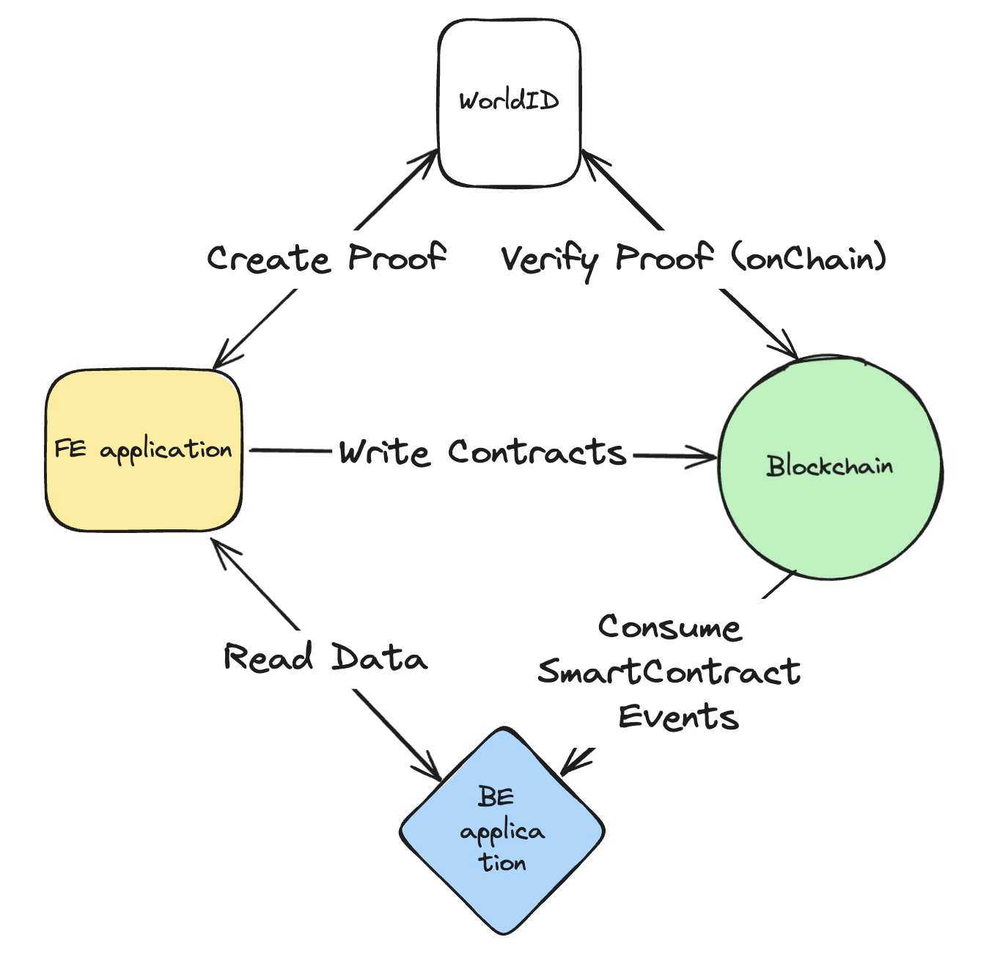

# DESTNetwork

DESTNet project from ETHGlobal Brussels 2024 hackathon

## Table of Contents
- [Introduction](#introduction)
- [Features](#features)
- [Demo](#demo)
- [User Flow](#user-flow)
- [Usage](#usage)
- [Technologies Used](#technologies-used)
- [Architecture](#architecture)
- [Smart Contracts](#smart-contracts)
- [Contributing](#contributing)
- [Contact](#contact)
- [Deployments](#deployments)

## Introduction

Decentralized Stash Network, Destnet or DEST Network is a DePIN project that incentivizes users in a particular area to create stashes of some items, to prepare for a natural disaster (medicine, inflatable boats, radio receivers, ...).

### Why

- South East Asian countries like India, Indonesia and Philippines not only face the highest risks of natural disasters, but also show the highest adoption of blockchain, treating it not merely as a get rich quick scheme.
- Climate change escalates risks of devastating natural disasters, preparing people in zones of risk is a great mitigation strategy.
- DePIN is a reasonable and exciting use-case for blockchain, but we feel that only a couple of different directions were explored.

## Features

- Destnet a DePIN project, where the idea of a public infrastructure is expanded beyond usual use cases
- Correctness of everything rests on the social consensus: submitted stashes are verified by other users and independent disputors
- Integration with [specific blockchain platform]
- User-friendly UI/UX

## Demo
Provide links to a live demo or video demonstration:
- [Live Demo](http://dest-network.web.app)
- [Video Demo](http://example.com/video)

## User Flow

- Anyone can create a stash campaign with description, a rectangular area, reward per submission and maximal number of submissions. Rewards can be paid in any ERC-20 token.
- Each user can create a submission with a photo, description and coordinates. All info is stored on our server, hash goes onchain.
- Reward is allocated immediately, but it is locked for ~3 months. Additionally, - user must cast all required votes before getting it.
- Verifiers are chosen randomly among other users. If a vote is not unanimous, new set of verifiers is sampled. After the vote is finalized, there is a 1 month period for disputing, which requires a deposit and could be done by anyone.
- Incorrect votes punished by half of their locked reward (or full disputror deposit / submitter reward), these are shared equally among all correct voters.

## Technologies Used

### Backend

- Web App: FastAPI, SQLAlchemy
- Smart Contract Events Consumer: web3py, multithreading
- Node API: Alchemy
- Deployment: Heroku

### Frontend

- App: Next.js
- BFF: Next.js
- Transaction signature: wagmi, viem, wallectConnect
- Deployment: Firebase

### Blockchain

Onchain logic is described in [this README](./contracts/destnet/README.md).

## Architecture

Common flow:
- User opens website and attaches wallet
    - Optionally: confirm wallet with World ID
- User selects campaign that they want to participate in, and provides submission info - location, photo, and description.
- With this info we call smart contract and create new transaction. This transacation then consumed on backend by listening for smart contract event.
    - Additionally, 3 verificators are added for this submissions
- By default, all submissions are created in disputed state. In order for user to get their reward, verificators need to either accept or reject submission. This info is also stored on blockchain
- Users can overview all submissions for a particular campaign on interactive map

## Deployments

| **Network**              | **DestnetToken Address**         |**CampaignManager Address**         |**sample StashCampaign Address**         | **ProofOfHumanity Address**         |
| ------------------    | -------------------------------------------- |-----------------|----------------------------|----------------------------|
|Base Sepolia   | [0x4a5cC743111e8Ba37cDd06A6E094f1ac907654AE](https://sepolia.basescan.org/address/0x4a5cC743111e8Ba37cDd06A6E094f1ac907654AE#code) | [0x83f17DD98e20b63B8d2d33bAf7a4074E302e3C25](https://sepolia.basescan.org/address/0x83f17DD98e20b63B8d2d33bAf7a4074E302e3C25#code) | [0x79A2751cD43a1f79C180d550118c0D861787aA24](https://sepolia.basescan.org/address/0x79A2751cD43a1f79C180d550118c0D861787aA24#code) | [0x2F7B383653f907a5f1D1c3ecF98201baa792952F](https://sepolia.basescan.org/address/0x2F7B383653f907a5f1D1c3ecF98201baa792952F) |
|Arbitrum Sepolia   | [0xc831F4861312f5Ea87eab12EeA7A65Bd6eA3610E](https://sepolia.arbiscan.io/address/0xc831F4861312f5Ea87eab12EeA7A65Bd6eA3610E#code) | [0x661a20c97d9973eA31733ABbf06F09777178eBeC](https://sepolia.arbiscan.io/address/0x661a20c97d9973eA31733ABbf06F09777178eBeC#code) | [0xB55bFEEc2b596C8Beb579Eb8CC24196BD5343a70](https://sepolia.arbiscan.io/address/0xB55bFEEc2b596C8Beb579Eb8CC24196BD5343a70#code) | None, World ID not supported |
|Scroll Sepolia   | [0xeca4Eee1DCEa4eeec1e7741a839C819Bae6635bC](https://sepolia.scrollscan.com/address/0xeca4Eee1DCEa4eeec1e7741a839C819Bae6635bC#code) | [0x4C86EC01616b2C255f01178845D13b783B3D5345](https://sepolia.scrollscan.com/address/0x4C86EC01616b2C255f01178845D13b783B3D5345#code) | [0x776BA2ec09E40544A386AD2d0a4001ab7987C946](https://sepolia.scrollscan.com/address/0x776BA2ec09E40544A386AD2d0a4001ab7987C946#code) | None, World ID not supported |
|Zircuit Testnet   | [0xeca4Eee1DCEa4eeec1e7741a839C819Bae6635bC](https://explorer.zircuit.com/address/0xeca4Eee1DCEa4eeec1e7741a839C819Bae6635bC) | [0x4C86EC01616b2C255f01178845D13b783B3D5345](https://explorer.zircuit.com/address/0x4C86EC01616b2C255f01178845D13b783B3D5345) | [0x776BA2ec09E40544A386AD2d0a4001ab7987C946](https://explorer.zircuit.com/address/0x776BA2ec09E40544A386AD2d0a4001ab7987C946) | None, World ID not supported |
|Morph Testnet   | [0xeca4Eee1DCEa4eeec1e7741a839C819Bae6635bC](https://explorer-testnet.morphl2.io/address/0xeca4Eee1DCEa4eeec1e7741a839C819Bae6635bC?tab=txs) | [0x4C86EC01616b2C255f01178845D13b783B3D5345](https://explorer-testnet.morphl2.io/address/0x4C86EC01616b2C255f01178845D13b783B3D5345?tab=txs) | [0x776BA2ec09E40544A386AD2d0a4001ab7987C946](https://explorer-testnet.morphl2.io/address/0x776BA2ec09E40544A386AD2d0a4001ab7987C946?tab=contract) | None, World ID not supported |
|Inco Testnet   | [0xaAB3cA5c8515f0b0301F678AAcdC8AFeCFA8D110](https://explorer.testnet.inco.org/address/0xaAB3cA5c8515f0b0301F678AAcdC8AFeCFA8D110) | [0xF630C81DE5b353dA3cf2cF35e901d018Dd96668C](https://explorer.testnet.inco.org/address/0xF630C81DE5b353dA3cf2cF35e901d018Dd96668C) | [0x33d68CA687f49c2b6CEa605C1B4783652358c722](https://explorer.testnet.inco.org/address/0x33d68CA687f49c2b6CEa605C1B4783652358c722) | None, World ID not supported |
|Celo Alfajores   | [0xaAB3cA5c8515f0b0301F678AAcdC8AFeCFA8D110](https://explorer.celo.org/alfajores/address/0xaAB3cA5c8515f0b0301F678AAcdC8AFeCFA8D110/transactions#address-tabs) | [0xF630C81DE5b353dA3cf2cF35e901d018Dd96668C](https://explorer.celo.org/alfajores/address/0xF630C81DE5b353dA3cf2cF35e901d018Dd96668C/transactions#address-tabs) | [0x33d68CA687f49c2b6CEa605C1B4783652358c722](https://explorer.celo.org/alfajores/address/0x33d68CA687f49c2b6CEa605C1B4783652358c722/transactions#address-tabs) | None, World ID not supported |
|Rootstock   | [0xf630c81de5b353da3cf2cf35e901d018dd96668c](https://explorer.testnet.rootstock.io/address/0xf630c81de5b353da3cf2cf35e901d018dd96668c) | [0x33d68ca687f49c2b6cea605c1b4783652358c722](https://explorer.testnet.rootstock.io/address/0x33d68ca687f49c2b6cea605c1b4783652358c722) | [0xcdb2223c6be2f0c233f1bd20aa5ecf6ac44fad74](https://explorer.testnet.rootstock.io/address/0xcdb2223c6be2f0c233f1bd20aa5ecf6ac44fad74) | None, World ID not supported |

## About the team

- [Sergey Shemyakov](https://www.linkedin.com/in/sergey-shemyakov/): Research Scientist at [Lisk](lisk.com/), 2.5 years of experience working on frontier of web3.
- [Kanstantsin Yaromenka](https://www.linkedin.com/in/kanstantsin-yaromenka-a24357174/): 
- [Dzmitry Ivanou](https://www.linkedin.com/in/dzmitry-ivanou-b9aa45139/): versatile backend developer with a lot of cloud experience.

## Zircuit feedback

- Connecting and deployments were very smooth, including bridging, etc.
- Were challenges with verification. Were not able to verify on website, neither with flat Solidity, nor with all files. Used forge verification from the docs, DestnetToken and CampaignManager were verified but I never managed to verify Stash Campaign. I spent ~45 mins and was running exactly the same verification command on other chains, where it was working, however I never managed to verify it on Zircuit.
